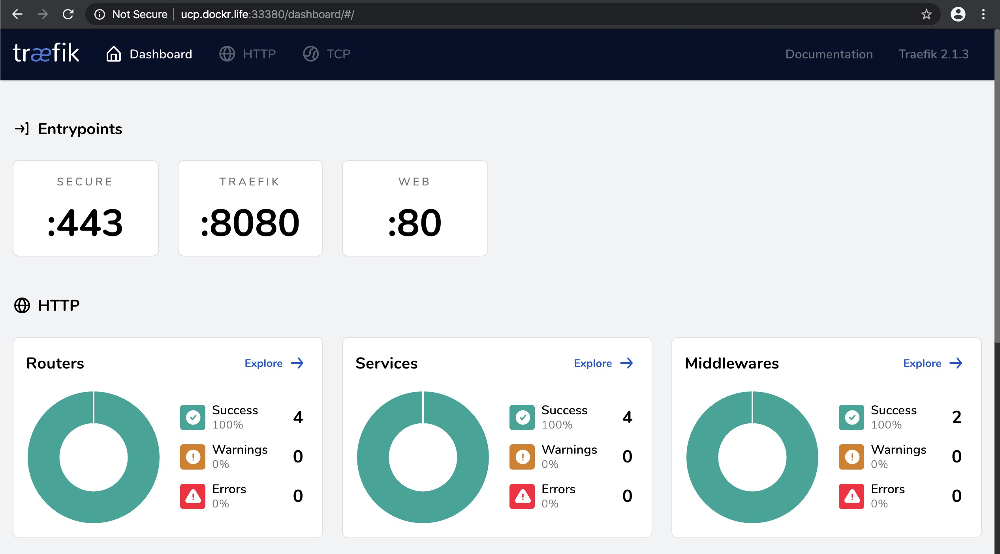
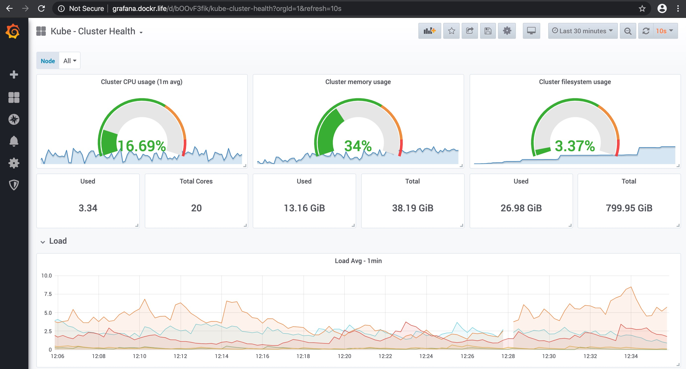
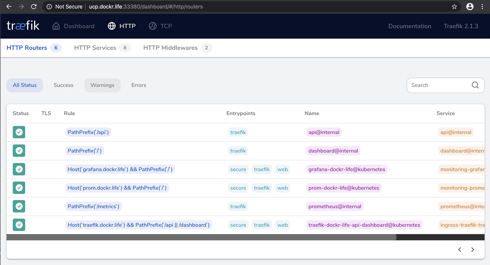

# Traefik Webinar

## Setup and Install

### Setup cluster

I use [github/clemenko/ucp](https://github.com/clemenko/ucp) for building Docker Enterprise. Honestly any k8s distribution should work. All my hosting is done on [DigitalOcean](http://digitlocean.com). They Rock!

Since I am using Docker Enterprise I need to source the client bundle to start talking to the cluster. 

```bash
source ./env.sh
```

One thing to note is that I store all the hosts names and ips in a file called `hosts.txt`. This allows me to do some fun stuff.

### Setup External Load Balancer

Ideally use your cloud providers' lb serivce. For the webinar I am going to use [DigitalOcean](http://digitlocean.com) again. Another option is to setup a node to run nginx as a load balancer. Below is a typical config for setting up Nginx as a TCP router. This is one of the easiest way to setup a load balancer if you do not have access to one from you infrastructure.

```bash
yum install -y yum-utils vim
yum-config-manager --add-repo https://download.docker.com/linux/centos/docker-ce.repo
yum install docker-ce -y
systemctl start docker
systemctl enable docker

cat << EOF >> stream.conf
user  nginx;
worker_processes  auto;

error_log  /var/log/nginx/error.log warn;
pid        /var/run/nginx.pid;

events {
    worker_connections  1024;
}

stream {
    upstream stream_backend {
        server worker1.dockr.life:33333 max_fails=3 fail_timeout=2s;
        server worker2.dockr.life:33333 max_fails=3 fail_timeout=2s;
        server worker3.dockr.life:33333 max_fails=3 fail_timeout=2s;
    }

    server {
        listen        80;
        proxy_pass    stream_backend;
        proxy_timeout 3s;
        proxy_connect_timeout 1s;
    }
}
EOF

docker run --rm -d -p 80:80 -v /root/stream.conf:/etc/nginx/nginx.conf:ro nginx:alpine
```

### Setup DNS

Having a dynamic ingress controller allows the use of a wildcard DNS entry. For this talk we have a wildcard CNAME pointing to the IP of the load balancer. This will allow any app to work on the `dockr.life` domains. This should make sense when we start deploying apps.

### Label Ingress Nodes

The idea is to label the specific ingress nodes you want to use. This will allow for an easier setup of the external load balancer and create the fastest path to the pod.

```bash
kubectl label nodes $(cat hosts.txt |tail -3|awk '{printf $2" "}') traefik=ingress
```

Basically I am labeling the three workers in the cluster. That label is then referenced as an `nodeSelector` in the yaml.

### Deploy Traefik

Before we deploy Traefik we should look at what we are deploying first. At a high level we need the following objects.

* Namespace - For logical separation
* ServiceAccount - For api access
* ClusterRole - RBAC role
* ClusterRoleBinding - RBAC binding
* DaemonSet - Pod distribution
* Service - Sevice to bind the pods
* Ingress - FQDN declaration

We should also look at the Traefik configs. There are a few for prometheus that are important. The most important one is about the provider. `--providers.kubernetesingress=true` tells Traefik to hit the Kubernetes API for discovery.

```yaml
        - "--api.insecure=true"
        - "--providers.kubernetesingress=true"
        - "--entrypoints.web.address=:80"
        - "--entrypoints.secure.address=:443"
        - "--metrics.prometheus=true"
        - "--metrics.prometheus.addEntryPointsLabels=true"
        - "--metrics.prometheus.addServicesLabels=true"
        - "--accesslog=true"
        - "--global.sendAnonymousUsage=false"
```

If you want to drill into the [traefik_ingress_controller.yml](https://github.com/clemenko/traefik_webinar/blob/master/traefik_ingress_controller.yml) itself feel free. The good news is that if your not that familiar with kubernetes yamls we can simply deploy it.

```bash
git clone https://github.com/clemenko/traefik_webinar
cd traefik_webinar
kubectl apply -f traefik_ingress_controller.yml
```

Here is what it looks like when deploying.

```bash
$ kubectl apply -f traefik_ingress_controller.yml
namespace/ingress-traefik created
serviceaccount/ingress-traefik created
clusterrole.rbac.authorization.k8s.io/ingress-traefik created
clusterrolebinding.rbac.authorization.k8s.io/ingress-traefik created
deployment.apps/traefik-ingress-controller created
service/traefik-ingress-service created
ingress.networking.k8s.io/traefik-ingress created
```

We can take a second to verify that the pods are on the nodes with the labels. Run `kubectl get pods` and double check the nodes.

```bash
kubectl get pods -n ingress-traefik -o wide
```

Here is the typical output. Make sure the pods are on they correct nodes.

```bash
$ kubectl get pods -n ingress-traefik -o wide
NAME                                          READY   STATUS    RESTARTS   AGE   IP                NODE       NOMINATED NODE   READINESS GATES
traefik-ingress-controller-767d4c68f8-2v64g   1/1     Running   0          52m   192.168.235.129   ddc-a3fe   <none>           <none>
traefik-ingress-controller-767d4c68f8-kvkd9   1/1     Running   0          52m   192.168.15.129    ddc-977a   <none>           <none>
traefik-ingress-controller-767d4c68f8-xdkbv   1/1     Running   0          52m   192.168.19.133    ddc-ae3e   <none>           <none>
```

We can also check that the service is setup:

```bash
$ kubectl get svc -n ingress-traefik -o wide
NAME                      TYPE       CLUSTER-IP      EXTERNAL-IP   PORT(S)                                     AGE     SELECTOR
traefik-ingress-service   NodePort   10.96.123.164   <none>        80:33333/TCP,8080:33380/TCP,443:33443/TCP   4m51s   k8s-app=traefik-ingress-lb
```

To simplify things we have set the ports to:

* Dashboard : 33380
* Web : 33333
* Secure : 33443

Now we can navigate to any one of the three worker nodes on that port.



OR use Traafik itself to route to the dashboard at [traefik.dockr.life](http://traefik.dockr.life/)!

### Deploy Prometheus and Grafana

Now that we have the load balancer, DNS, and Traefik setup we can deploy a monitoring solution. It is nice to have some metrics and pretty graphs.

```bash
kubectl apply -f prometheus/.
```

example :

```bash
$ kubectl apply -f prometheus/. 
clusterrolebinding.rbac.authorization.k8s.io/kube-state-metrics created
clusterrole.rbac.authorization.k8s.io/kube-state-metrics created
deployment.apps/kube-state-metrics created
rolebinding.rbac.authorization.k8s.io/kube-state-metrics created
role.rbac.authorization.k8s.io/kube-state-metrics-resizer created
serviceaccount/kube-state-metrics created
service/kube-state-metrics created
namespace/monitoring created
clusterrole.rbac.authorization.k8s.io/prometheus created
clusterrolebinding.rbac.authorization.k8s.io/prometheus created
serviceaccount/prometheus created
daemonset.extensions/node-exporter created
daemonset.extensions/cadvisor created
service/alertmanager created
configmap/alertmanager-config created
configmap/alertmanager-templates created
deployment.extensions/alertmanager created
configmap/prometheus-configmap created
service/prometheus-svc created
deployment.extensions/prometheus-deployment created
configmap/grafana-datasource created
configmap/grafana-dashboard-providers created
service/grafana created
deployment.extensions/grafana created
configmap/blackbox-configmap created
deployment.extensions/blackbox-exporter created
service/blackbox-exporter created
ingress.extensions/grafana-ingress created
ingress.extensions/prom-ingress created
configmap/grafana-dashboards created
```

Let's look at the Grafana dashboard at [grafana.dockr.life](grafana.dockr.life). Thanks to the wildcard DNS entry the domain name just works.

The login for grafana is `admin / Pa22word`.

Out of the box I have included a few handy dashboards. Check out the `Kube - Cluster Health` dashboard.



The prometheus dashboard can be found at [prom.dockr.life](prom.dockr.life).

You can also check the `routers` that Traefik knows about by exploring the `Routers` page.



### Deploy a few more apps

Let's deploy a few more apps and check the dashboard.
```bash
kubectl apply -f k8s_all_the_things.yml
kubectl apply -f whoami.yml
```

Now that we have a few apps deployed we should take a quick look at how to get Traefik to recognize the app. In Kubernetes you need the Ingress object. Here is an example from the [whoami.yml](https://github.com/clemenko/traefik_webinar/blob/master/whoami.yml). Notice the `host:` is where you specify the FQDN. Simple right?

```yaml
apiVersion: networking.k8s.io/v1beta1
kind: Ingress
metadata:
  name: whoami
  namespace: whoami
spec:
  rules:
  - host: whoami.dockr.life
    http:
      paths:
      - path: /
        backend:
          serviceName: whoami
          servicePort: 8000
```

## Shameless Pitch

Let's take a look at how [StackRox](https://stackrox.com) can add more observability to the infrastructure. Having a security strategy is paramount in today's age.

## HA demo

Let's test killing a node? But first we need a curl.

```bash
#in separate window
while true; do curl -s --connect-timeout .5 app.dockr.life/info|jq -c; done

#stop docker
kubectl get pods -n ingress-traefik -o wide
ssh root@$(cat ../../ucp/hosts.txt | tail -1 | awk '{print $1}') 'systemctl stop docker'
kubectl get pods -n ingress-traefik -o wide
```

## Nmap Enforcement

Let's be bad and run `nmap` in a container.

```bash
kubectl get pod -n flask
kubectl -n flask exec -it $(kubectl -n flask get pod|grep Running|grep flask|shuf -n1|awk '{print $1}') -- nmap -v -sn 192.168.1.0/24
kubectl get pod -n flask
```

## Caveats

For this demo I am not using state-full storage. Typically you will want to use the best storage solution from your hosting provider. I am also not covering Let's Encrypt or other TLS situations.

## Docs

Please go read the [Traefik Doc](https://andyc.info/traefik).

Also they have a fantastic forum at [https://community.containo.us/c/traefik/5](https://community.containo.us/c/traefik/5).
